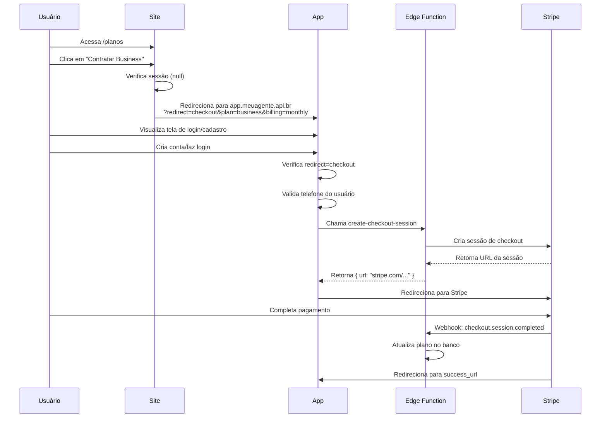
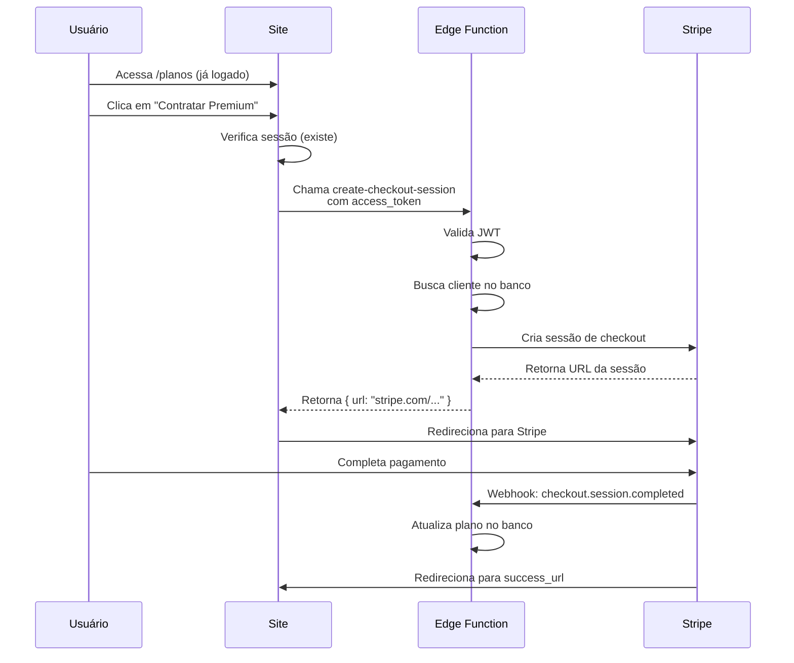

# Fluxo de Checkout - Site Meu Agente

> **Última atualização:** 8 de dezembro de 2025  
> **Versão:** 1.0  
> **Responsável:** Documentação Técnica

## 📋 Índice

1. [Visão Geral](#visão-geral)
2. [Arquitetura do Sistema](#arquitetura-do-sistema)
3. [Fluxo Completo do Usuário](#fluxo-completo-do-usuário)
4. [Componentes Envolvidos](#componentes-envolvidos)
5. [Hook useSubscription](#hook-usesubscription)
6. [Mapeamento de Planos](#mapeamento-de-planos)
7. [URLs e Redirecionamentos](#urls-e-redirecionamentos)
8. [Tratamento de Erros](#tratamento-de-erros)
9. [Casos de Uso](#casos-de-uso)
10. [Integração com Stripe](#integração-com-stripe)
11. [Checklist de Testes](#checklist-de-testes)
12. [Troubleshooting](#troubleshooting)

---

## 🎯 Visão Geral

O fluxo de checkout do site Meu Agente é responsável por gerenciar a contratação de planos por novos usuários e usuários existentes, integrando-se com:

- **Supabase Auth** - Autenticação de usuários
- **Supabase Edge Functions** - Backend serverless para processamento
- **Stripe Checkout** - Processamento de pagamentos
- **App Principal** - Aplicação SaaS onde o usuário usa os serviços

### Características Principais

✅ Suporte a usuários logados e não logados  
✅ Redirecionamento inteligente para o app  
✅ Ciclos de cobrança mensais e anuais  
✅ 5 planos disponíveis (Free, Lite, Básico, Business, Premium)  
✅ Integração completa com Stripe  
✅ Tratamento robusto de erros  

---

## 🏗️ Arquitetura do Sistema

```
┌─────────────────────────────────────────────────────────────────┐
│                          SITE (Marketing)                       │
│                                                                 │
│  ┌──────────────┐    ┌──────────────┐    ┌──────────────┐    │
│  │  /planos     │    │ PricingSection│    │ HeroSection  │    │
│  │  (página)    │    │  (home)      │    │              │    │
│  └──────┬───────┘    └──────┬───────┘    └──────┬───────┘    │
│         │                   │                    │             │
│         └───────────────────┼────────────────────┘             │
│                             ▼                                  │
│                  ┌──────────────────────┐                     │
│                  │  useSubscription     │                     │
│                  │  (hook)              │                     │
│                  └──────────┬───────────┘                     │
│                             │                                  │
└─────────────────────────────┼──────────────────────────────────┘
                              │
                ┌─────────────┴─────────────┐
                │                           │
        Usuário NÃO logado          Usuário LOGADO
                │                           │
                ▼                           ▼
┌───────────────────────────┐    ┌──────────────────────┐
│  APP (meuagente.api.br)   │    │  Edge Function       │
│  ?redirect=checkout       │    │  create-checkout-    │
│  &plan=X&billing=Y        │    │  session             │
└───────────┬───────────────┘    └──────────┬───────────┘
            │                               │
            │ (após login/cadastro)         │
            ▼                               │
┌──────────────────────────┐               │
│  Edge Function           │◄──────────────┘
│  create-checkout-session │
└───────────┬──────────────┘
            │
            ▼
┌──────────────────────────┐
│  Stripe Checkout         │
│  (sessão de pagamento)   │
└───────────┬──────────────┘
            │
            ▼
┌──────────────────────────┐
│  Webhook Stripe          │
│  (atualiza plano)        │
└──────────────────────────┘
```

---

## 🔄 Fluxo Completo do Usuário

### Cenário 1: Usuário Novo (Não Logado)



### Cenário 2: Usuário Existente (Logado no Site)



---

## 🧩 Componentes Envolvidos

### 1. Página de Planos (`src/pages/Planos.tsx`)

**Responsabilidades:**
- Exibir todos os planos disponíveis (Free, Lite, Básico, Business, Premium)
- Permitir alternância entre ciclo mensal e anual
- Exibir calculadora de ROI
- Gerenciar estado do plano selecionado no hero

**Botões de Ação:**
```tsx
// Plano Free
onClick={() => window.open("https://app.meuagente.api.br/?plan=free", "_blank")}

// Planos pagos
onClick={() => handleSubscribe(planId, billingCycle)}
```

**Estados Principais:**
- `heroPlanId`: Plano selecionado no hero (padrão: "lite")
- `billingCycle`: "monthly" | "annual"
- `loading`: Estado de carregamento durante checkout

### 2. Seção de Preços (`src/components/sections/PricingSection.tsx`)

**Responsabilidades:**
- Exibir grid de planos na home
- Mesma lógica de contratação da página de planos
- Design responsivo e otimizado

**Estrutura:**
```tsx
<section className="py-24 bg-background">
  {/* Free, Lite, Básico (3 colunas) */}
  <div className="grid gap-8 md:grid-cols-2 lg:grid-cols-3">
    {plans.slice(0, 3).map(...)}
  </div>
  
  {/* Business, Premium (cards horizontais) */}
  <div className="flex flex-col gap-8">
    {plans.slice(3, 5).map(...)}
  </div>
</section>
```

### 3. Seção Hero (`src/components/sections/HeroSection.tsx`)

**Responsabilidades:**
- Primeiro contato com o usuário
- CTA principal: "Começar Gratuitamente"
- Redireciona para o app sem especificar plano

```tsx
<Button onClick={() => window.open("https://app.meuagente.api.br", "_blank")}>
  Começar Gratuitamente
</Button>
```

### 4. CTA Final (`src/components/sections/FinalCTASection.tsx`)

**Responsabilidades:**
- Última chamada para ação na página
- Duas opções: "Criar Conta Gratuita" e "Falar com Especialista"

```tsx
// Ambos redirecionam para o app
window.open("https://app.meuagente.api.br", "_blank")
```

---

## 🪝 Hook useSubscription

**Localização:** `src/hooks/use-subscription.ts`

### Estrutura

```typescript
export const useSubscription = () => {
  const [loading, setLoading] = useState(false);

  const handleSubscribe = async (planId: string, billing: BillingCycle = 'monthly') => {
    // Lógica de checkout
  };

  return {
    handleSubscribe,
    loading,
  };
};
```

### Fluxo Interno

```typescript
handleSubscribe(planId, billing) {
  setLoading(true)
  
  // 1. Verificar sessão
  session = await supabase.auth.getSession()
  
  if (!session) {
    // Usuário não logado
    params = {
      redirect: 'checkout',
      plan: planId,
      billing: billing,
      price_id: PRICE_IDS[planId][billing]
    }
    
    window.location.href = `${APP_URL}/?${params}`
    return
  }
  
  // 2. Usuário logado - chamar Edge Function
  { data, error } = await supabase.functions.invoke('create-checkout-session', {
    body: {
      plan_id: planId,
      billing_cycle: billing,
      price_id: PRICE_IDS[planId][billing],
      success_url: `${origin}/sucesso?session_id={CHECKOUT_SESSION_ID}`,
      cancel_url: `${origin}/planos`
    }
  })
  
  // 3. Redirecionar para Stripe
  if (data?.url) {
    window.location.href = data.url
  }
  
  setLoading(false)
}
```

### Constantes

```typescript
const PRICE_IDS: Record<string, { monthly?: string; annual?: string }> = {
  lite: {
    monthly: 'price_1SbygeDUMJkQwpuNfKOSWoRL',
    annual: 'price_1SbykvDUMJkQwpuNnawqHQi2',
  },
  basic: {
    monthly: 'price_1SWpI2DUMJkQwpuNYUAcU5ay',
    annual: 'price_1SbykyDUMJkQwpuNHSyxzqSH',
  },
  business: {
    monthly: 'price_1SWpI3DUMJkQwpuNbd9GWlWK',
    annual: 'price_1Sbyl3DUMJkQwpuN80srGDzm',
  },
  premium: {
    monthly: 'price_1SWpI4DUMJkQwpuN9NfkqZzL',
    annual: 'price_1Sbyl6DUMJkQwpuNUq1TF9Wq',
  },
};

const APP_URL = 'https://app.meuagente.api.br';
```

### Tratamento de Erros

```typescript
try {
  // lógica de checkout
} catch (error: any) {
  console.error('Erro ao iniciar checkout:', error);
  
  toast.error('Erro ao iniciar assinatura', {
    description: error.message || 'Tente novamente mais tarde.',
  });
} finally {
  setLoading(false);
}
```

---

## 💎 Mapeamento de Planos

### Tabela Completa de Planos

| Plano | ID | Preço Mensal | Preço Anual | Economia Anual | Stripe Price ID (Monthly) | Stripe Price ID (Annual) |
|-------|----|--------------|--------------|-----------------|-----------------------------|---------------------------|
| **Free** | `free` | R$ 0,00 | R$ 0,00 | - | - | - |
| **Lite** | `lite` | R$ 97,90 | R$ 1.076,90 | ~R$ 98 (1 mês grátis) | `price_1SbygeDUMJkQwpuNfKOSWoRL` | `price_1SbykvDUMJkQwpuNnawqHQi2` |
| **Básico** | `basic` | R$ 497,00 | R$ 5.467,00 | ~R$ 497 (1 mês grátis) | `price_1SWpI2DUMJkQwpuNYUAcU5ay` | `price_1SbykyDUMJkQwpuNHSyxzqSH` |
| **Business** | `business` | R$ 997,00 | R$ 10.967,00 | ~R$ 997 (1 mês grátis) | `price_1SWpI3DUMJkQwpuNbd9GWlWK` | `price_1Sbyl3DUMJkQwpuN80srGDzm` |
| **Premium** | `premium` | R$ 1.497,00 | R$ 16.467,00 | ~R$ 1.497 (1 mês grátis) | `price_1SWpI4DUMJkQwpuN9NfkqZzL` | `price_1Sbyl6DUMJkQwpuNUq1TF9Wq` |

### Estrutura de Dados dos Planos

```typescript
interface Plan {
  id: 'free' | 'lite' | 'basic' | 'business' | 'premium';
  name: string;
  priceMonthly: number;
  priceAnnual: number;
  period: string;
  description: string;
  badge: string | null;
  features: Array<{
    text: string;
    included: boolean;
  }>;
  cta: string;
  popular: boolean;
}
```

### Recursos por Plano

#### Free
- ✅ Acesso ao app em nuvem + Chat IA
- ✅ Agente Financeiro (manual no app)
- ✅ Agente Web Search básico (manual/Chat IA)
- ✅ Agente de Scrape básico (manual/Chat IA)
- ❌ Automação fora do app
- ❌ Uso via WhatsApp
- ❌ Exportação CSV/PDF

#### Lite (MAIS POPULAR)
- ✅ Tudo do Free
- ✅ Agente Financeiro no WhatsApp (áudio/foto)
- ✅ Agente de Agendamento no WhatsApp (áudio/foto)
- ✅ Respostas 24/7 via canal WhatsApp compartilhado
- ❌ Exportação CSV/PDF
- ❌ Número de WhatsApp próprio

#### Básico
- ✅ Tudo do Lite + automações via WhatsApp
- ✅ Exportação CSV/PDF
- ✅ Agente Web Search intermediário
- ✅ Agente Scrape intermediário
- ✅ Infraestrutura em nuvem
- ❌ Número de WhatsApp próprio
- ❌ Implantação inclusa

#### Business (MELHOR VALOR)
- ✅ Tudo do Básico
- ✅ Número de WhatsApp próprio
- ✅ Implantação inclusa
- ✅ Suporte prioritário 24/7 (SLA 2h)
- ✅ Agente SDR (qualificação + agendamento)
- ✅ Agente Marketing (Google Ads)
- ✅ Agente Dev + Vídeo (Veo 3)
- ✅ Integrações Google (custo adicional)
- ✅ Treinamento da IA (R$ 149/hr, sob demanda)

#### Premium
- ✅ Tudo do Business
- ✅ Agente de Confirmação (diário)
- ✅ Agente de Resumo de Grupos
- ✅ Agente de Remarketing
- ✅ Agente de Follow-up
- ✅ Pesquisa/extração avançada
- ✅ Backups diários off-site (3-2-1)
- ✅ Cota maior Vídeo (Veo 3)
- ✅ Análises mensais personalizadas

---

## 🔗 URLs e Redirecionamentos

### URLs Principais

| Tipo | URL | Descrição |
|------|-----|-----------|
| **Site** | `https://site.meuagente.api.br` | Landing page e marketing |
| **App** | `https://app.meuagente.api.br` | Aplicação SaaS principal |
| **Edge Functions** | `https://*.supabase.co/functions/v1/*` | Backend serverless |
| **Stripe** | `https://checkout.stripe.com/*` | Páginas de pagamento |

### Parâmetros de URL

#### Redirecionamento para App (usuário não logado)

```
https://app.meuagente.api.br/?redirect=checkout&plan=business&billing=monthly&price_id=price_XXX
```

**Parâmetros:**
- `redirect` - Tipo de ação pós-login (`checkout`)
- `plan` - ID do plano (`lite`, `basic`, `business`, `premium`)
- `billing` - Ciclo de cobrança (`monthly` | `annual`)
- `price_id` - ID do preço no Stripe (opcional, mas recomendado)

#### Plano Free

```
https://app.meuagente.api.br/?plan=free
```

**Nota:** Plano Free não passa por checkout, apenas registra o usuário.

#### URLs de Retorno do Stripe

**Success URL:**
```
https://site.meuagente.api.br/sucesso?session_id={CHECKOUT_SESSION_ID}
```

**Cancel URL:**
```
https://site.meuagente.api.br/planos
```

---

## ⚠️ Tratamento de Erros

### Cenários de Erro

#### 1. Usuário sem Telefone Cadastrado

**Erro da Edge Function:**
```json
{
  "error": "Cliente não encontrado. Entre em contato com o suporte."
}
```

**Tratamento no Site:**
```typescript
if (data?.error) {
  toast.error('Erro ao iniciar assinatura', {
    description: data.error
  });
  return;
}
```

**Responsabilidade:** App deve coletar telefone antes de chamar checkout.

#### 2. Plano Inválido

**Validação:**
```typescript
const validPlans = ['lite', 'basic', 'business', 'premium'];
if (!validPlans.includes(planId)) {
  toast.error('Plano inválido');
  return;
}
```

#### 3. Erro de Rede

**Tratamento:**
```typescript
try {
  const { data, error } = await supabase.functions.invoke(...);
  if (error) throw error;
} catch (error: any) {
  toast.error('Erro ao conectar com o servidor', {
    description: 'Verifique sua conexão e tente novamente.'
  });
}
```

#### 4. Sessão Expirada

**Detecção:**
```typescript
const { data: { session }, error } = await supabase.auth.getSession();

if (error) {
  toast.error('Sessão inválida', {
    description: 'Por favor, faça login novamente.'
  });
  // Redirecionar para login
}
```

#### 5. Stripe Checkout Falhou

**Cenários:**
- URL de checkout não retornada
- Timeout na criação da sessão
- Cartão recusado (tratado pelo Stripe)

**Tratamento:**
```typescript
if (!data?.url) {
  throw new Error('URL de checkout não retornada');
}
```

### Mensagens de Erro Padrão

```typescript
const ERROR_MESSAGES = {
  NO_SESSION: 'Você precisa estar logado para contratar um plano.',
  INVALID_PLAN: 'Plano selecionado é inválido.',
  NO_CHECKOUT_URL: 'Não foi possível iniciar o checkout. Tente novamente.',
  NETWORK_ERROR: 'Erro de conexão. Verifique sua internet.',
  GENERIC_ERROR: 'Ocorreu um erro inesperado. Entre em contato com o suporte.',
};
```

---

## 📚 Casos de Uso

### Caso 1: Usuário Vem de Anúncio do Google

```
1. Usuário clica em anúncio
   ↓
2. Chega em /planos no site
   ↓
3. Analisa planos e calculadora de ROI
   ↓
4. Clica em "Contratar Business"
   ↓
5. É redirecionado para app.meuagente.api.br?redirect=checkout&plan=business
   ↓
6. Cria conta no app
   ↓
7. App detecta redirect=checkout
   ↓
8. App valida se tem telefone cadastrado
   ↓
9. App chama create-checkout-session
   ↓
10. Usuário é levado ao Stripe
    ↓
11. Completa pagamento
    ↓
12. Webhook atualiza plano
    ↓
13. Usuário retorna ao app com plano ativo
```

### Caso 2: Usuário Existente Fazendo Upgrade

```
1. Usuário já logado no site (raro, mas possível)
   ↓
2. Acessa /planos
   ↓
3. Clica em "Contratar Premium"
   ↓
4. Site verifica sessão (existe)
   ↓
5. Site chama create-checkout-session diretamente
   ↓
6. Usuário vai para Stripe
   ↓
7. Completa pagamento
   ↓
8. Webhook atualiza plano de basic → premium
   ↓
9. Retorna ao site com confirmação
```

### Caso 3: Usuário Quer Testar Grátis

```
1. Usuário clica em "Começar Agora" (plano Free)
   ↓
2. É redirecionado para app.meuagente.api.br?plan=free
   ↓
3. Cria conta no app
   ↓
4. App registra usuário com plano free
   ↓
5. Usuário começa a usar imediatamente
```

### Caso 4: Usuário Decide Mudar Durante Cadastro

```
1. Usuário clicou em "Contratar Básico"
   ↓
2. Durante o cadastro no app, muda de ideia
   ↓
3. Pode voltar ao site e clicar em outro plano
   ↓
4. Ou completar o cadastro e depois mudar no app
```

---

## 💳 Integração com Stripe

### Edge Function: create-checkout-session

**Endpoint:** `supabase.functions.invoke('create-checkout-session')`

**Request Body:**
```typescript
{
  plan_id: 'basic' | 'business' | 'premium',
  billing_cycle?: 'monthly' | 'annual',
  price_id?: string,
  success_url: string,
  cancel_url: string,
  locale?: string
}
```

**Response Success:**
```typescript
{
  url: 'https://checkout.stripe.com/c/pay/cs_test_...'
}
```

**Response Error:**
```typescript
{
  error: 'Cliente não encontrado. Entre em contato com o suporte.'
}
```

### Webhook: stripe-webhook

**Eventos Tratados:**

1. **checkout.session.completed**
   - Atualiza `clientes.plan_id`
   - Define `billing_provider = 'stripe'`
   - Salva `stripe_customer_id` e `external_subscription_id`

2. **invoice.payment_succeeded**
   - Confirma pagamento recorrente
   - Atualiza `subscription_active = true`

3. **customer.subscription.updated**
   - Sincroniza mudanças no plano
   - Atualiza datas de renovação

4. **customer.subscription.deleted**
   - Reverte para plano `free`
   - Define `subscription_active = false`

5. **invoice.payment_failed**
   - Notifica usuário
   - Mantém plano por período de grace

### Mapeamento Price ID → Plan ID

```typescript
const PRICE_TO_PLAN: Record<string, string> = {
  // Lite
  'price_1SbygeDUMJkQwpuNfKOSWoRL': 'lite',
  'price_1SbykvDUMJkQwpuNnawqHQi2': 'lite',
  
  // Basic
  'price_1SWpI2DUMJkQwpuNYUAcU5ay': 'basic',
  'price_1SbykyDUMJkQwpuNHSyxzqSH': 'basic',
  
  // Business
  'price_1SWpI3DUMJkQwpuNbd9GWlWK': 'business',
  'price_1Sbyl3DUMJkQwpuN80srGDzm': 'business',
  
  // Premium
  'price_1SWpI4DUMJkQwpuN9NfkqZzL': 'premium',
  'price_1Sbyl6DUMJkQwpuNUq1TF9Wq': 'premium',
};
```

---

## ✅ Checklist de Testes

### Testes Funcionais

- [ ] **Plano Free**
  - [ ] Botão redireciona para `app.meuagente.api.br/?plan=free`
  - [ ] Parâmetro `plan` é recebido corretamente no app
  - [ ] Usuário é cadastrado com `plan_id = 'free'`

- [ ] **Planos Pagos - Usuário Novo**
  - [ ] Clicar em "Contratar Lite" redireciona com todos os parâmetros
  - [ ] Parâmetros incluem: `redirect`, `plan`, `billing`, `price_id`
  - [ ] App detecta `redirect=checkout` após login
  - [ ] Checkout é iniciado automaticamente
  - [ ] Stripe Checkout abre corretamente

- [ ] **Planos Pagos - Usuário Logado**
  - [ ] Edge Function é chamada diretamente
  - [ ] Redirecionamento para Stripe funciona
  - [ ] URLs de sucesso e cancelamento estão corretas

- [ ] **Ciclo Anual**
  - [ ] Toggle mensal/anual funciona
  - [ ] Preços são atualizados corretamente
  - [ ] Badge "1 mês grátis" aparece
  - [ ] Confetti dispara ao ativar anual
  - [ ] `price_id` correto é enviado

- [ ] **Estados de Loading**
  - [ ] Botão mostra spinner durante processamento
  - [ ] Botão fica desabilitado durante loading
  - [ ] Loading é resetado após erro

- [ ] **Tratamento de Erros**
  - [ ] Erro de rede mostra toast adequado
  - [ ] Plano inválido é bloqueado
  - [ ] Sessão expirada redireciona para login
  - [ ] Erro da Edge Function é exibido

### Testes de Integração

- [ ] **Webhook Stripe**
  - [ ] `checkout.session.completed` atualiza plano
  - [ ] Metadados são salvos corretamente
  - [ ] `billing_events` registra evento

- [ ] **Sincronização de Dados**
  - [ ] Plano atualizado no banco aparece no app
  - [ ] `stripe_customer_id` é salvo
  - [ ] `external_subscription_id` é salvo

### Testes de UX

- [ ] **Design Responsivo**
  - [ ] Layout mobile está correto
  - [ ] Botões são clicáveis em touch
  - [ ] Cards de planos adaptam ao tamanho

- [ ] **Acessibilidade**
  - [ ] Labels estão corretos
  - [ ] Navegação por teclado funciona
  - [ ] Contraste adequado

- [ ] **Performance**
  - [ ] Checkout inicia em < 2s
  - [ ] Sem delays perceptíveis
  - [ ] Animações suaves

### Testes de Segurança

- [ ] **Validação**
  - [ ] JWT é validado na Edge Function
  - [ ] Price IDs são validados
  - [ ] SQL injection não é possível

- [ ] **Proteção**
  - [ ] Webhook valida assinatura Stripe
  - [ ] Não expõe dados sensíveis
  - [ ] Rate limiting está ativo

---

## 🔧 Troubleshooting

### Problema: "Cliente não encontrado"

**Causa:** Usuário não tem telefone cadastrado.

**Solução:**
1. App deve coletar telefone antes do checkout
2. Verificar `user.user_metadata.phone`
3. Implementar tela de onboarding no app

### Problema: Checkout não abre

**Possíveis Causas:**
- Edge Function retornou erro
- URL de checkout inválida
- Bloqueio de pop-up no navegador

**Debug:**
```typescript
console.log('Response from Edge Function:', data);
console.log('Stripe URL:', data?.url);
```

**Solução:**
1. Verificar logs da Edge Function no Supabase
2. Testar em navegador diferente
3. Verificar se Stripe está ativo

### Problema: Plano não atualiza após pagamento

**Possíveis Causas:**
- Webhook não foi disparado
- Webhook falhou na validação
- Erro no processamento do evento

**Debug:**
1. Verificar Dashboard Stripe → Webhooks → Tentativas
2. Checar tabela `billing_events` no Supabase
3. Ver logs da Edge Function `stripe-webhook`

**Solução:**
1. Reenviar webhook manualmente no Stripe
2. Verificar `STRIPE_WEBHOOK_SECRET`
3. Validar lógica de mapeamento price → plan

### Problema: Redirecionamento com parâmetros não funciona

**Causa:** App não está lendo query params.

**Solução no App:**
```typescript
// No app, ao carregar rota de auth
const params = new URLSearchParams(window.location.search);
const redirect = params.get('redirect');
const plan = params.get('plan');

// Salvar em context/storage
sessionStorage.setItem('checkout_intent', JSON.stringify({ redirect, plan }));
```

### Problema: Erro CORS

**Causa:** Edge Function não aceita origem do site.

**Solução:**
```typescript
// Na Edge Function
const corsHeaders = {
  'Access-Control-Allow-Origin': 'https://site.meuagente.api.br',
  'Access-Control-Allow-Headers': 'authorization, x-client-info, apikey, content-type',
};
```

### Problema: Loading infinito

**Causa:** Promise não está sendo resolvida.

**Debug:**
```typescript
try {
  const { data, error } = await supabase.functions.invoke(...);
  console.log('Invoke result:', { data, error });
} catch (e) {
  console.error('Invoke exception:', e);
} finally {
  setLoading(false); // SEMPRE executar
}
```

---

## 📝 Notas Técnicas

### Decisões de Design

1. **Por que redirecionar para o App ao invés de fazer checkout no Site?**
   - Centralizar autenticação no app
   - Evitar duplicação de lógica
   - Melhor experiência pós-pagamento

2. **Por que não usar Stripe Customer Portal no Site?**
   - Portal é para gerenciar assinatura existente
   - Primeiro checkout deve ser via Checkout Session
   - Portal será usado no app para mudanças de plano

3. **Por que salvar phone no user_metadata?**
   - Necessário para criar cliente JIT
   - Facilita lookup na Edge Function
   - Consistência com arquitetura existente

### Limitações Conhecidas

1. **Usuário logado no Site (raro)**
   - Site pode chamar Edge Function diretamente
   - Mas maioria dos usuários não estará logada no site
   - Foco é no fluxo via app

2. **Mudança de Plano**
   - Atualmente feita via suporte ou reprocesso
   - Futura implementação: Stripe Customer Portal no app
   - Upgrade/downgrade com prorate

3. **Plano Free → Pago**
   - Usuário free precisa ir ao app e escolher plano
   - Não há CTA direto no site para upgrade
   - Isso pode ser melhorado com remarketing

### Roadmap Futuro

- [ ] Implementar Customer Portal no app
- [ ] Adicionar suporte a cupons de desconto
- [ ] Permitir trial period de 7 dias
- [ ] Criar página de comparação detalhada
- [ ] A/B testing de CTAs
- [ ] Analytics de conversão por plano
- [ ] Remarketing para usuários free

---

## 📚 Referências

- [Stripe Subscriptions Documentation](https://docs.stripe.com/subscriptions)
- [Supabase Edge Functions](https://supabase.com/docs/guides/functions)
- [Supabase Auth](https://supabase.com/docs/guides/auth)
- [React Hook Best Practices](https://react.dev/reference/react)

---

## 📞 Suporte

Para dúvidas sobre este fluxo:
- **Email:** dev@meuagente.api.br
- **Documentação adicional:** `/docs/dev/`
- **Slack:** #dev-checkout

---

**Última revisão:** 8 de dezembro de 2025  
**Mantenedor:** Equipe de Desenvolvimento Meu Agente
